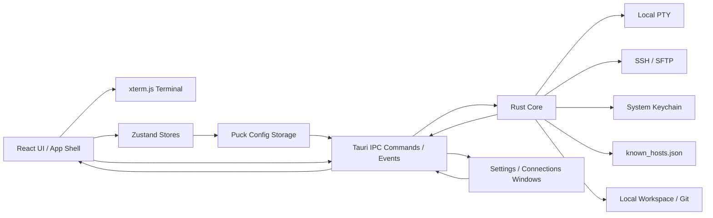

# Puck Terminal 文档：架构与技术栈

## 1. 技术栈

| 层级 | 技术 | 责任 |
| --- | --- | --- |
| 桌面壳 | Tauri v2 | 窗口、权限、IPC、菜单、系统能力、打包 |
| 后端 | Rust | PTY、SSH、SFTP、凭据、配置文件、安全边界 |
| 前端 | React + TypeScript + Vite | UI、状态、终端容器、用户交互、多窗口页面 |
| UI | shadcn/ui 风格组件 + Tailwind CSS | 基础组件、主题变量、布局控件 |
| 终端 | xterm.js | 终端渲染、输入输出、选择、搜索、适配尺寸 |
| 国际化 | i18next | 多语言资源、语言切换、错误码映射 |
| 前端状态 | Zustand + Puck 配置存储 | 连接配置、偏好、布局、权限、传输队列 |
| 安全存储 | 系统钥匙串 | 密码、私钥口令 |

Rust 后端 SSH/SFTP 使用 `russh`、`russh-keys`、`russh-sftp`；本地终端使用 `portable-pty`；系统文件选择使用 Tauri dialog 插件；打开外部资源使用 Tauri opener 插件。

## 2. 总体架构

## 3. 前后端职责

### 3.1 前端职责

- 渲染三栏工作台、终端标签、文件管理器、详情面板、设置窗口和连接管理窗口。
- 管理 UI 状态，例如当前标签、面板可见性、详情视图、主题、语言。
- 创建和销毁 xterm.js 实例及其插件。
- 将用户输入、终端尺寸变化、连接请求、文件操作、配置读写请求通过 Tauri IPC 发送给 Rust。
- 接收 Rust 事件并更新终端输出、连接状态、配置同步和传输队列。
- 持久化非敏感连接配置、偏好、布局和权限设置。

前端不得直接处理：

- 私钥解析与密码认证。
- 本地 PTY 创建。
- SSH、SFTP 网络连接。
- 敏感凭据持久化。

### 3.2 Rust 后端职责

- 创建、管理和销毁本地 PTY。
- 检测系统 shell 和 WSL 环境。
- 建立 SSH 远程 shell 会话。
- 建立 SFTP 文件传输会话。
- 管理 session id 到 PTY / SSH / SFTP 资源的映射。
- 将终端输出、连接状态、传输状态和配置变化通过事件推送到前端。
- 调用系统钥匙串保存和读取敏感凭据。
- 维护 SSH known hosts 信任记录。
- 提供统一配置文件读写、辅助窗口创建、本地目录读取、Git 状态和 macOS 外部应用打开。

FTP / FTPS 后端尚未实现，协议字段和 UI 入口仅作为后续扩展预留。

## 4. IPC 命令

### 4.1 终端与 SSH

| 命令 | 用途 |
| --- | --- |
| `list_shells` | 返回可用本地 shell 与 WSL 发行版 |
| `get_system_identity` | 返回当前系统用户名和主机名，用于终端标题 |
| `open_local_terminal` | 创建本地终端会话 |
| `open_ssh_terminal` | 创建 SSH 终端会话 |
| `reconnect_ssh_terminal` | 使用后端保存的 SSH profile 信息重连 |
| `write_terminal` | 向指定终端会话写入用户输入 |
| `resize_terminal` | 调整 PTY 或远程终端尺寸 |
| `close_session` | 关闭终端或文件会话 |

### 4.2 SFTP 与传输

| 命令 | 用途 |
| --- | --- |
| `open_file_connection` | 打开 SFTP 文件连接 |
| `list_remote_dir` | 读取远程目录 |
| `mkdir_remote` | 创建远程目录 |
| `delete_remote` | 删除远程文件或目录 |
| `rename_remote` | 重命名远程文件或目录 |
| `start_transfer` | 创建上传或下载任务 |

### 4.3 凭据与 known hosts

| 命令 | 用途 |
| --- | --- |
| `save_credential` | 保存密码或私钥口令到系统钥匙串 |
| `has_credential` | 检查指定凭据是否存在 |
| `delete_credential` | 删除指定凭据 |
| `delete_connection_credentials` | 删除连接关联的密码和私钥口令 |
| `get_known_hosts_file_path` | 返回 known hosts 文件路径 |
| `list_known_hosts` | 获取已信任主机密钥 |
| `delete_known_host` | 删除已信任主机密钥 |
| `trust_ssh_host_key` | 信任并持久化 SSH 主机密钥 |

### 4.4 配置、窗口和工作区

| 命令 | 用途 |
| --- | --- |
| `get_config_dir` | 返回 Puck 配置目录 |
| `get_config_file_path` | 返回 `config.toml` 路径 |
| `load_puck_config_sections` | 启动期批量读取 UI 配置区段 |
| `get_puck_config_section` | 读取指定配置区段 |
| `set_puck_config_section` | 写入指定配置区段并广播配置变化 |
| `remove_puck_config_section` | 删除指定配置区段并广播配置变化 |
| `apply_macos_window_chrome` | 为窗口应用 macOS 视觉效果 |
| `open_settings_window` | 打开或聚焦 Settings 辅助窗口 |
| `open_connections_window` | 打开或聚焦 Connections 辅助窗口 |
| `list_local_dir` | 读取本地目录 |
| `git_status` | 获取本地工作目录 Git 状态 |
| `open_path_in_app` | 在外部应用中打开路径，目前仅支持 macOS |

## 5. 事件

| 事件 | 用途 |
| --- | --- |
| `terminal:data` | 终端输出 |
| `terminal:exit` | 终端进程退出或远程 shell 结束 |
| `session:status` | 会话连接状态变化、连接错误、host key 提示 |
| `transfer:progress` | 文件传输进度 |
| `transfer:done` | 文件传输完成 |
| `transfer:error` | 文件传输失败 |
| `puck:config-changed` | 配置区段变化，用于跨窗口 rehydrate |
| `puck:menu-action` | macOS 原生菜单动作转发 |
| `connection:open-profile` | Connections 窗口请求主窗口打开 profile |

浏览器环境下，部分跨窗口能力使用 `localStorage` 事件或 `BroadcastChannel` 作为降级方案。

## 6. 状态模型与配置存储

前端运行时状态：

- `session-store`：当前打开的终端和文件会话，不持久化。
- `terminal-split-store`：当前两窗格分屏布局，不持久化。
- `command-outline-store`：每个终端最多 500 条命令大纲，不持久化。
- `transfer-store`：传输任务、进度、错误、重试状态。
- `shell-ui-store`：运行中面板可见性、详情视图和主侧栏页签。

前端持久化状态：

- `app_settings`：语言、主题、终端外观、默认面板可见性、默认会话权限。
- `connections`：非敏感连接配置，不包含明文密码。
- `sidebar_layout`：会话分组和排序。
- `session_privileges`：每个 session 的通知、响铃、鼠标捕获等权限开关。
- `shell_layout`：三栏宽度布局。
- `hosts_layout`：前端已定义该 key，但 Rust 配置存储尚未接纳该区段，当前不应视为可靠持久化能力。

Rust 持久化：

- `~/.config/puck/config.toml`：统一配置文件，按区段保存前端 Zustand JSON。
- `~/.config/puck/known_hosts.json`：SSH known hosts 记录。
- 系统钥匙串：密码和私钥口令。

启动时，前端先预加载 Puck 配置存储，再 rehydrate 各个 Zustand store。旧版 localStorage 和旧版分散 JSON 文件有迁移逻辑，但新文档以 `config.toml` 为当前基线。

## 7. 凭据与安全边界

- 普通配置可以保存协议、名称、host、port、username、认证方式、私钥路径、默认目录和终端偏好。
- 密码和私钥口令不进入普通配置文件。
- 凭据 key 使用 `puck.connection.<connectionId>.<field>`。
- 保存连接时，如果用户选择“每次询问”，会删除对应已保存凭据。
- 快速连接创建 ephemeral profile；最后一个引用该 profile 的 session 关闭后，会删除关联凭据并移除 profile。
- SSH host key 信任记录与普通配置分离，保存在 `known_hosts.json`。

## 8. Tauri 权限边界

当前 capability 覆盖 `main`、`settings`、`connections` 三个窗口，权限包括：

- `core:default` 和必要窗口控制权限。
- `core:webview:allow-create-webview-window`：创建辅助窗口。
- `opener:default`：打开外部链接或 reveal 路径。
- `dialog:default`：选择私钥文件、上传文件、保存下载路径。

文件系统访问优先通过后端显式命令完成，不允许前端任意访问系统路径。网络连接由 Rust 后端建立，并限制在用户创建的连接配置或显式输入上。新增插件或更大权限前需要同步更新 capability 与文档。
