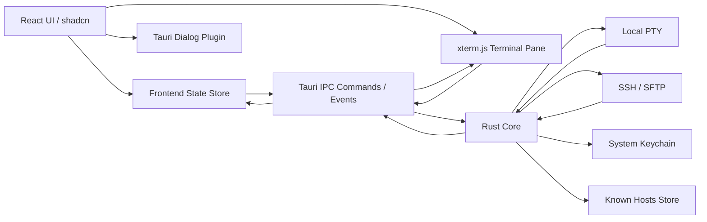

# Puck Terminal 文档：架构与技术栈

## 1. 技术栈

| 层级 | 技术 | 责任 |
| --- | --- | --- |
| 桌面壳 | Tauri v2 | 窗口、权限、IPC、系统能力、打包 |
| 后端 | Rust | PTY、SSH、SFTP、凭据、安全边界 |
| 前端 | React + TypeScript + Vite | UI、状态、路由、终端容器、用户交互 |
| UI | shadcn/ui + Tailwind CSS | 基础组件、主题变量、布局控件 |
| 终端 | xterm.js | 终端渲染、输入输出、选择、搜索、适配尺寸 |
| 国际化 | i18next | 多语言资源、语言切换、错误码映射 |
| 前端状态 | Zustand + localStorage | 连接配置、会话、偏好、传输队列 |
| 安全存储 | 系统钥匙串 | 密码、私钥口令、敏感 token |

当前后端 SSH/SFTP 使用 `russh`、`russh-keys`、`russh-sftp`；本地终端使用 `portable-pty`；系统文件选择使用 Tauri dialog 插件。

## 2. 总体架构

## 3. 前后端职责

### 3.1 前端职责

- 渲染应用布局、连接列表、终端标签、文件管理器、设置页。
- 管理 UI 状态，例如当前标签、选中连接、主题、语言。
- 创建和销毁 xterm.js 实例。
- 将用户输入、终端尺寸变化、文件操作请求通过 Tauri IPC 发送给 Rust。
- 接收 Rust 事件并更新终端输出、连接状态和传输队列。
- 持久化非敏感连接配置和用户偏好。

前端不得直接处理：

- 私钥解析与密码认证。
- 本地 PTY 创建。
- SSH、SFTP 网络连接。
- 敏感凭据持久化。

### 3.2 Rust 后端职责

- 创建、管理和销毁本地 PTY。
- 检测系统 shell 和 WSL 环境。
- 建立 SSH 远程 shell 会话。
- 建立 SFTP 文件传输会话。
- 管理会话 ID、连接生命周期、断线状态。
- 将终端输出和传输状态通过事件推送到前端。
- 调用系统钥匙串保存和读取敏感凭据。
- 维护 SSH known hosts 信任记录。

FTP / FTPS 后端尚未实现，协议字段和部分 UI 入口仅作为后续扩展预留。

## 4. IPC 设计原则

Tauri IPC 分为命令和事件：

- 命令用于用户主动操作，例如创建会话、写入终端、调整尺寸、开始上传。
- 事件用于后端异步推送，例如终端输出、连接断开、传输进度、错误通知。

当前 IPC 命令：

| 命令 | 用途 |
| --- | --- |
| `list_shells` | 返回可用本地 shell 与 WSL 发行版 |
| `open_local_terminal` | 创建本地终端会话 |
| `open_ssh_terminal` | 创建 SSH 终端会话 |
| `reconnect_ssh_terminal` | 使用已保存的 SSH 会话配置重新连接 |
| `write_terminal` | 向指定终端会话写入用户输入 |
| `resize_terminal` | 调整 PTY/远程终端尺寸 |
| `close_session` | 关闭终端或文件会话 |
| `open_file_connection` | 打开 SFTP 文件连接 |
| `list_remote_dir` | 读取远程目录 |
| `mkdir_remote` | 创建远程目录 |
| `delete_remote` | 删除远程文件或目录 |
| `rename_remote` | 重命名远程文件或目录 |
| `start_transfer` | 创建上传或下载任务 |
| `save_credential` | 保存密码或私钥口令到系统钥匙串 |
| `delete_credential` | 删除指定凭据 |
| `delete_connection_credentials` | 删除连接关联凭据 |
| `list_known_hosts` | 获取已信任主机密钥 |
| `trust_ssh_host_key` | 信任并持久化 SSH 主机密钥 |

当前事件：

| 事件 | 用途 |
| --- | --- |
| `terminal:data` | 终端输出 |
| `terminal:exit` | 终端进程退出或远程 shell 结束 |
| `session:status` | 会话连接状态变化 |
| `transfer:progress` | 文件传输进度 |
| `transfer:done` | 文件传输完成 |
| `transfer:error` | 文件传输失败 |

## 5. 状态模型

前端状态按用途拆分：

- App Settings：语言、UI 主题、终端主题、字体、字号。
- Connection Profiles：连接配置列表，不含敏感明文。
- Sessions：当前打开的终端和文件连接实例。
- Transfer Queue：传输任务、进度、错误、重试次数。

Rust 状态按资源拆分：

- Session Registry：保存 session id 到 PTY/网络连接句柄的映射。
- Credential Service：统一读取/写入系统钥匙串。
- Known Hosts Store：保存 SSH host key 信任记录。
- SFTP Command Channel：按 session 转发目录读取、删除、重命名、传输命令。
- Transfer Events：上传下载任务通过事件上报进度、完成和失败。

## 6. 凭据存储策略

连接配置可以保存在本地配置中，但敏感信息必须单独处理：

- 普通配置：协议、名称、host、port、username、默认路径、主题偏好。
- 敏感配置：密码、私钥口令。
- 私钥文件路径可以保存，但私钥内容默认不复制进配置。
- 凭据 key 使用 `puck.connection.<connectionId>.<field>`。

当前策略：

1. 配置保存时生成 `connectionId`。
2. 敏感字段写入系统钥匙串，key 使用 `puck.connection.<connectionId>.<field>`。
3. 普通配置保存认证方式、私钥路径和非敏感连接字段。
4. 删除连接时同步删除关联凭据。

## 7. 终端渲染策略

xterm.js 只负责前端显示与输入，不持有真实终端进程：

- 每个终端标签对应一个 xterm.js 实例和一个 Rust session id。
- 用户输入通过 `write_terminal` 发给 Rust。
- Rust 将 PTY/SSH 输出通过 `terminal:data` 事件推给对应实例。
- 终端尺寸变化通过 `resize_terminal` 同步到后端。
- 终端主题由前端应用，不影响后端会话。
- SSH 终端重连复用后端保存的连接配置，不要求前端重新提交敏感信息。

## 8. Tauri 权限边界

当前 capability 保持最小权限：

- `core:default`：Tauri 基础能力。
- `opener:default`：打开外部链接或资源。
- `dialog:default`：选择私钥文件、上传文件、保存下载路径。
- 文件系统访问优先通过后端显式命令完成。
- 不允许前端任意访问系统路径。
- 网络连接由 Rust 后端建立，并限制在用户创建的连接配置或显式输入上。
- 新增插件或更大权限前需要先确认用途，并同步更新 capability 与文档。

