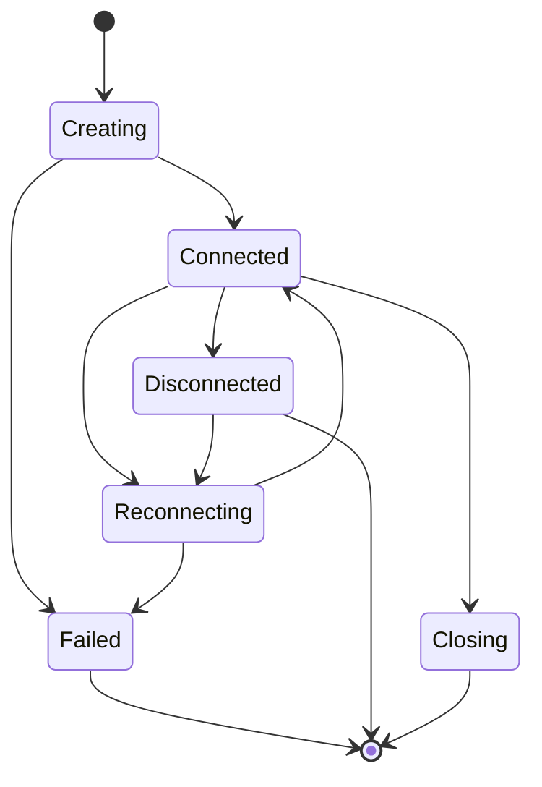

# Puck Terminal 设计开发文档：连接模型与协议

## 1. 连接模型

所有连接统一抽象为 Connection Profile。Profile 是可保存的配置，Session 是运行中的实例。

```ts
type ConnectionProtocol = "local" | "ssh" | "sftp" | "ftp" | "ftps";

type AuthMethod = "none" | "password" | "privateKey" | "agent";

type ConnectionProfile = {
  id: string;
  name: string;
  protocol: ConnectionProtocol;
  host?: string;
  port?: number;
  username?: string;
  authMethod?: AuthMethod;
  credentialRef?: string;
  privateKeyPath?: string;
  defaultDirectory?: string;
  terminalThemeId?: string;
  createdAt: string;
  updatedAt: string;
};
```

实现时可以调整字段类型，但必须保持以下原则：

- Profile 不保存明文密码。
- 同一个 SSH Profile 可以被 SSH 终端和 SFTP 文件管理器复用。
- FTP/FTPS Profile 只用于文件连接，不创建终端 shell。
- Local Profile 表示本地 shell 启动配置。

## 2. Session 生命周期

Session 是运行时资源，不能简单等同于 Profile。

状态流：



核心规则：

- 每个 Session 必须有唯一 `sessionId`。
- 前端标签关闭时，必须通知 Rust 释放对应资源。
- 后端检测到进程退出或网络断开时，必须推送状态事件。
- 断线后不自动无限重连，首版采用手动重连。
- 关闭 Session 需要同时取消相关未完成传输或提示用户确认。

## 3. 本地终端

本地终端需要通过 Rust 创建 PTY。

### 3.1 shell 检测

macOS / Linux：

- 读取当前用户默认 shell。
- 检测常见路径：`/bin/zsh`、`/bin/bash`、`/usr/bin/fish`。
- 允许用户手动添加自定义 shell 路径。

Windows：

- 检测 PowerShell。
- 检测 Windows PowerShell。
- 检测 cmd。
- 检测 WSL 发行版。

### 3.2 WSL 识别

Windows 下通过后端检测 WSL：

- 使用系统命令或 API 获取可用发行版列表。
- 将每个发行版展示为可启动 shell。
- 启动时需要记录发行版名称和默认目录。

### 3.3 基础能力

- 输入输出流稳定转发。
- 支持 resize。
- 支持 UTF-8。
- 支持 Ctrl+C、Ctrl+D、方向键等控制序列。
- 支持复制、粘贴、选择文本。

## 4. SSH 终端

SSH 用于远程交互式 shell。

### 4.1 认证方式

MVP 支持：

- 用户名 + 密码。
- 用户名 + 私钥文件。
- 用户名 + 私钥文件 + 私钥口令。

后续支持：

- SSH agent。
- ProxyJump。
- 端口转发。
- known_hosts 严格校验策略。

### 4.2 连接行为

- 默认端口 22。
- 连接超时需要有明确错误。
- 认证失败需要区分密码错误、密钥不可读、host 不可达。
- 连接成功后创建远程 shell channel。
- 终端 resize 必须同步到远程 PTY。

### 4.3 安全策略

- 密码和私钥口令不得进入前端持久化状态。
- 首次连接未知 host key 时必须提示用户确认。
- host key 确认结果需要持久化。
- 文档阶段先定义策略，实现阶段可以按库能力细化。

## 5. SFTP

SFTP 基于 SSH 连接，主要用于文件管理器。

### 5.1 能力范围

MVP 支持：

- 连接远程目录。
- 列出文件和目录。
- 进入目录、返回上级。
- 上传文件。
- 下载文件。
- 删除文件。
- 重命名文件。
- 新建目录。

暂不支持：

- 远程文件编辑。
- 文件预览。
- 目录同步。
- 权限批量修改。

### 5.2 UI 行为

- SFTP 可以从 SSH 连接配置直接打开。
- 文件管理器显示路径面包屑、文件列表、操作菜单、传输队列。
- 大文件传输进入队列，不阻塞 UI。
- 失败任务允许重试。

## 6. FTP / FTPS

FTP/FTPS 用于文件传输，不提供终端 shell。

### 6.1 协议区分

- FTP：明文控制连接与数据连接，默认端口 21。
- FTPS：FTP over TLS，默认端口 21，支持显式 TLS。

首版优先支持显式 FTPS。隐式 FTPS 可作为后续增强。

### 6.2 能力范围

MVP 支持：

- 用户名 + 密码认证。
- 目录浏览。
- 上传、下载、删除、重命名、新建目录。
- 被动模式。

后续支持：

- 主动模式。
- 证书高级校验配置。
- 断点续传。
- 目录同步。

## 7. 文件传输队列

所有协议的上传下载统一进入 Transfer Queue。

任务字段建议：

```ts
type TransferTask = {
  id: string;
  sessionId: string;
  protocol: "sftp" | "ftp" | "ftps";
  direction: "upload" | "download";
  localPath: string;
  remotePath: string;
  bytesTotal?: number;
  bytesTransferred: number;
  status: "queued" | "running" | "paused" | "done" | "failed" | "cancelled";
  errorMessage?: string;
};
```

MVP 必须支持：

- 队列展示。
- 进度展示。
- 取消任务。
- 失败重试。
- 完成后保留短期历史。

暂停/恢复可放到后续版本。

## 8. 错误处理

错误必须按用户可理解的方式分类：

| 类型 | 示例 |
| --- | --- |
| 配置错误 | host 为空、端口非法、私钥路径不存在 |
| 网络错误 | DNS 失败、连接超时、连接被拒绝 |
| 认证错误 | 密码错误、私钥口令错误、权限不足 |
| 协议错误 | FTP 不支持某命令、SFTP 操作失败 |
| 本地错误 | 本地路径无权限、磁盘空间不足 |
| 会话错误 | 远程断开、PTY 退出 |

前端展示错误时需要同时提供：

- 简短用户文案。
- 可展开的技术细节。
- 可行动入口，例如重试、编辑连接、查看日志。

