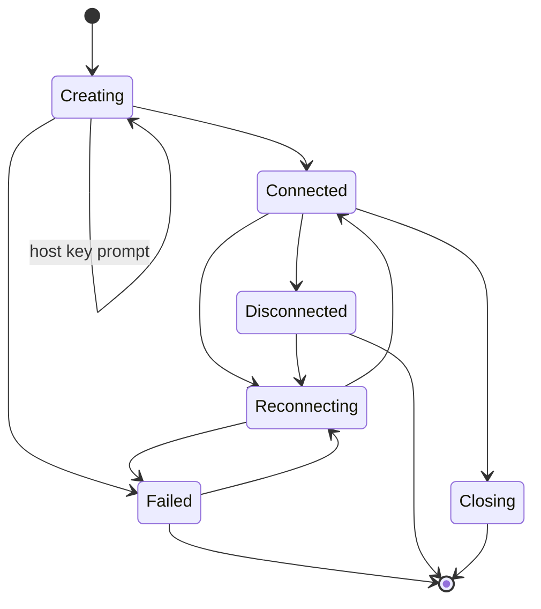

# Puck Terminal 文档：连接模型与协议

## 1. 连接模型

所有可复用连接统一抽象为 Connection Profile。Profile 是可保存或临时存在的配置，Session 是运行中的实例。

```ts
type ConnectionProtocol = "local" | "ssh" | "sftp" | "ftp" | "ftps";

type AuthMethod = "none" | "password" | "privateKey" | "agent";

type ConnectionProfile = {
  id: string;
  name: string;
  protocol: ConnectionProtocol;
  host?: string;
  port?: number;
  username?: string;
  authMethod?: AuthMethod;
  askPasswordEachTime?: boolean;
  credentialRef?: string;
  privateKeyPath?: string;
  defaultDirectory?: string;
  terminalThemeId?: string;
  ephemeral?: boolean;
  createdAt: string;
  updatedAt: string;
};
```

核心规则：

- Profile 不保存明文密码或私钥口令。
- `askPasswordEachTime` 为 true 时，连接前弹出凭据输入框，凭据只在当前连接尝试中使用。
- `ephemeral` 表示快速连接创建的临时 profile，不写入持久化配置；最后一个引用会话关闭后清理凭据和 profile。
- 同一 SSH Profile 可以被 SSH 终端和 SFTP 文件浏览复用。
- FTP/FTPS 类型在连接模型中保留以便后续扩展，但 UI 已禁用，不创建终端 shell。
- `credentialRef` 可作为兼容字段存在，但实际凭据 key 由后端按 `connectionId` 和字段名生成。

## 2. Session 生命周期

Session 是运行时资源，不能等同于 Profile。

```ts
type SessionStatus =
  | "creating"
  | "connected"
  | "reconnecting"
  | "disconnected"
  | "failed"
  | "closing";

type SessionKind = "terminal" | "files";
```

状态流：



核心规则：

- 每个 Session 必须有唯一 `sessionId`。
- 前端标签关闭时，必须通知 Rust 释放对应资源。
- 后端检测到进程退出或网络断开时，必须推送状态事件。
- 断线后不自动无限重连，当前采用手动重连。
- 关闭文件 Session 会释放 SFTP 会话；传输队列保留任务结果。
- 两窗格分屏会基于当前终端复制一个新 Session，而不是复用同一个后端 session。

## 3. 本地终端

本地终端通过 Rust 创建 PTY，并由 xterm.js 承载显示和输入。

### 3.1 shell 检测

macOS / Linux：

- 读取当前用户默认 shell。
- 检测常见路径：`/bin/zsh`、`/bin/bash`、`/usr/bin/fish` 等。
- 可从命令面板或新建终端菜单选择检测到的 shell。

Windows：

- 检测 PowerShell。
- 检测 Windows PowerShell。
- 检测 cmd。
- 检测 WSL 发行版。

### 3.2 基础能力

- 输入输出流稳定转发。
- 支持 resize。
- 支持 UTF-8。
- 支持 Ctrl+C、Ctrl+D、方向键等控制序列。
- 支持复制、粘贴、选择文本、链接识别。
- 支持当前标签和全部标签搜索。
- 支持根据 OSC 7 更新工作目录。

## 4. SSH 终端

SSH 用于远程交互式 shell。

### 4.1 认证方式

当前支持：

- 用户名 + 密码。
- 用户名 + 私钥文件。
- 用户名 + 私钥文件 + 私钥口令。
- 保存凭据到系统钥匙串。
- 每次连接时临时输入密码或私钥口令。

后续支持：

- SSH agent。
- ProxyJump。
- 端口转发。

### 4.2 连接行为

- 默认端口 22。
- 连接请求由前端构造，Rust 后端建立网络连接。
- 首次未知 host key 会返回 `host_key_unknown` 状态，前端展示确认 Dialog。
- 连接成功后创建远程 shell channel。
- 终端 resize 同步到远程 PTY。
- 远程断开后前端展示状态，并允许用户手动重连。
- 重连复用后端保存的 profile 摘要，但不会要求普通配置中保存敏感明文。

### 4.3 安全策略

- 密码和私钥口令不得进入前端持久化状态。
- 如果凭据未保存，前端会弹出凭据输入框；密码模式下可在用户输入后保存到钥匙串。
- 首次连接未知 host key 时必须提示用户确认。
- known hosts 记录可以在 Settings 的 Connections 区段查看和删除。

## 5. SFTP

SFTP 基于 SSH 连接，主要用于文件管理器和右侧 Files 面板。

### 5.1 能力范围

当前支持：

- 连接远程目录。
- 列出文件和目录。
- 进入目录、返回上级、刷新、隐藏文件切换。
- 上传文件。
- 下载文件。
- 删除文件。
- 重命名文件。
- 新建目录。
- 展示文件大小、修改时间、权限信息。

暂不支持：

- 远程文件编辑。
- 文件预览。
- 目录同步。
- 权限批量修改。

### 5.2 UI 行为

- SFTP 可以从 SSH 或 SFTP 连接配置直接打开。
- SSH 终端右侧 Files 面板会建立独立 explorer SFTP session，并默认跟随远程终端工作目录或 profile 默认目录。
- 文件管理器显示路径面包屑、文件列表、操作按钮和传输队列入口。
- 大文件传输进入队列，不阻塞 UI。
- 失败任务允许重试。
- 删除操作需要用户确认。
- 上传使用系统文件选择器，下载使用系统保存对话框。

## 6. FTP / FTPS

FTP/FTPS 用于后续文件传输能力，不提供终端 shell。连接模型保留 `ftp` / `ftps` 类型，但 UI 中已禁用协议选项并标注「即将支持」；`openProfileSession` 会拦截未实现协议。Rust 后端连接与文件操作尚未实现。

当前限制：

- 不应将 FTP/FTPS 描述为可用文件管理能力。
- 现有文件连接后端是 SFTP 实现，尚未按 FTP/FTPS 协议分流。

后续需要支持：

- 用户名 + 密码认证。
- 目录浏览。
- 上传、下载、删除、重命名、新建目录。
- 被动模式。
- 显式 FTPS。

## 7. 文件传输队列

当前 SFTP 上传下载统一进入 Transfer Queue。FTP/FTPS 接入后应复用同一个队列模型。

```ts
type TransferTask = {
  id: string;
  sessionId: string;
  direction: "upload" | "download";
  localPath: string;
  remotePath: string;
  fileName: string;
  bytesTotal?: number;
  bytesTransferred: number;
  status: "queued" | "running" | "done" | "failed" | "cancelled";
  errorMessage?: string;
};
```

当前支持：

- 队列展示。
- 进度展示。
- 成功、失败状态。
- 失败重试。
- 清除已完成任务。

取消、暂停、恢复可放到后续版本。

## 8. 错误处理

错误按用户可理解的方式分类：

| 类型 | 示例 |
| --- | --- |
| 配置错误 | host 为空、端口非法、私钥路径不存在 |
| 网络错误 | DNS 失败、连接超时、连接被拒绝 |
| 认证错误 | 密码错误、私钥口令错误、权限不足 |
| 协议错误 | SFTP 操作失败、SSH channel 关闭 |
| 本地错误 | 本地路径无权限、磁盘空间不足 |
| 会话错误 | 远程断开、PTY 退出 |

Rust 错误通过 JSON 字符串传回前端，包含 `code`、`message`、`details` 和可选 `hostKey`。前端使用 `parsePuckError` 解析，并通过 `errors` i18n namespace 映射用户文案。

`session:status` 事件既用于普通连接状态，也用于 host key 提示和连接失败状态。前端应根据 `errorCode` 和 `hostKey` 决定展示 Dialog、toast、重连入口或技术细节。
