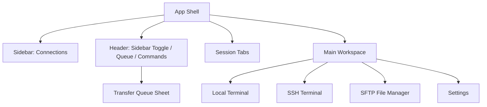

# Puck Terminal 文档：UI、主题与多语言

## 1. 设计原则

Puck Terminal 是工具型桌面应用，界面应优先服务高频操作：

- 信息密度适中，避免营销页式大面积装饰。
- 主要操作常驻，低频配置进入设置或菜单。
- 终端区域最大化可用空间。
- 错误、断线、传输状态要清晰可见。
- 主题和字体设置不能影响终端可读性。
- 后续 UI 微调应优先优化层级、间距、状态反馈和空态，不应改变核心工作流。

## 2. 信息架构



## 3. 主要界面

### 3.1 App Shell

当前应用主界面包含：

- 左侧连接侧边栏。
- 顶部 Header。
- 会话标签栏。
- 主工作区。
- 右侧传输队列 Sheet。
- 全局命令面板入口。

当前行为：

- 可配置启动后是否打开本地终端。
- 侧边栏可折叠。
- 多标签支持关闭和切换。
- 文件管理器和终端可以通过标签并存。
- Header 中的命令面板入口目前为预留入口。

后续样式微调重点：

- 减少 Header、Tabs、Sidebar 之间的视觉噪音。
- 强化活动标签与连接状态的可识别性。
- 保持终端和文件管理器区域尽可能大的可用面积。

### 3.2 连接列表

连接列表当前支持：

- 按协议筛选。
- 搜索连接。
- 新建、编辑、复制、删除连接。
- 从 SSH 连接打开终端或 SFTP。
- SFTP 连接打开文件管理器。
- FTP/FTPS 协议配置预留，但文件管理能力尚未实现。

连接卡片或列表项展示：

- 名称。
- 协议徽标。
- host 与 username。

后续可优化：

- 增加最近连接时间。
- 增加收藏、分组或置顶。
- 增加更明确的 hover / active / destructive 操作状态。

### 3.3 终端工作区

终端工作区由 xterm.js 承载。

当前支持：

- 自适应容器尺寸。
- 复制、粘贴。
- Web link 识别。
- 搜索插件基础接入。
- SSH 断开后手动重连。
- 字体和字号设置。
- 终端主题切换。

后续不急于加入：

- 分屏。
- 广播输入。
- session 录制。
- AI 命令建议。

这些能力可以作为后续版本扩展。

### 3.4 文件管理器

文件管理器当前用于 SFTP。

界面元素：

- 路径面包屑。
- 文件列表。
- 上传按钮。
- 新建目录按钮。
- 刷新按钮。
- 删除、重命名、下载操作。
- 传输队列入口位于全局 Header。

文件列表列：

- 名称。
- 大小。
- 修改时间。
- 权限或属性。

操作规则：

- 点击目录进入。
- 选中文件后可下载、重命名或删除。
- 删除操作需要确认。
- 上传下载需要进入传输队列。

后续样式微调重点：

- 文件行选中态、目录图标、危险操作状态需要更清晰。
- 空目录、加载中、连接失败应有更完整空态。
- 小窗口下操作按钮需要考虑收纳为更多菜单。

### 3.5 设置页

当前设置页聚焦基础偏好：

- General：语言、启动行为。
- Appearance：UI 主题、终端主题、字体、字号。

后续设置页方向：

- Connections：凭据管理、host key 管理。
- Keyboard：快捷键查看与自定义。
- About：版本信息和诊断信息。

## 4. shadcn/ui 组件策略

使用 shadcn/ui 时遵循：

- Button：主要操作、图标按钮。
- Sidebar：连接与会话导航。
- Tabs：顶部会话标签。
- Dialog / Sheet：连接编辑、确认删除、设置面板。
- DropdownMenu / ContextMenu：文件和连接的更多操作。
- Command：全局命令面板后续接入。
- Table：文件列表。
- Badge：协议和状态。
- Progress：传输进度。
- Tooltip：图标按钮说明。
- Alert：连接错误、安全提示。
- Separator / Resizable：布局分隔。

不要为基础控件重复造轮子。特殊区域如 xterm.js 容器和文件表格可以封装业务组件，但底层交互控件优先复用 shadcn/ui。

## 5. xterm.js 集成策略

每个终端标签包含一个独立 xterm.js 实例。

当前插件：

- `@xterm/addon-fit`：自适应容器尺寸。
- `@xterm/addon-search`：终端搜索。
- `@xterm/addon-web-links`：识别 URL。
- `@xterm/addon-clipboard`：剪贴板增强。

事件规则：

- `onData` 将用户输入转发到 Rust。
- `onResize` 将列数和行数转发到 Rust。
- 后端 `terminal:data` 事件写入对应 xterm 实例。
- 组件卸载时 dispose xterm 实例和插件。

## 6. 主题系统

主题分为两层：

### 6.1 应用 UI 主题

应用 UI 主题控制：

- 背景。
- 前景文字。
- 边框。
- 侧边栏。
- 弹窗。
- 按钮。
- 状态色。

必须支持：

- Light。
- Dark。
- System。

### 6.2 终端主题

终端主题控制 xterm.js：

- foreground。
- background。
- cursor。
- selection。
- ANSI 16 色。

内置主题建议：

- Puck Dark。
- Puck Light。
- Solarized Dark。
- Solarized Light。
- One Dark。

应用 UI 主题和终端主题可以独立选择。例如应用为亮色，终端为暗色。

## 7. 多语言

首版至少支持：

- `zh-CN`。
- `en-US`。

语言资源按模块组织：

```text
src/i18n/locales/
  zh-CN/
    common.json
    connections.json
    terminal.json
    files.json
    settings.json
    errors.json
  en-US/
    common.json
    connections.json
    terminal.json
    files.json
    settings.json
    errors.json
```

文案规则：

- 主要 UI 文案必须使用 i18n key。
- 错误信息由 Rust 返回结构化错误码，前端映射成本地化文案。
- 技术细节可以保留原始英文，但需要有本地化摘要。
- 日期、时间、文件大小按当前语言格式化。

## 8. 快捷键

快捷键体系目前尚未完整实现。后续建议：

| 快捷键 | 功能 |
| --- | --- |
| Cmd/Ctrl + T | 新建本地终端 |
| Cmd/Ctrl + W | 关闭当前标签 |
| Cmd/Ctrl + K | 打开命令面板 |
| Cmd/Ctrl + , | 打开设置 |
| Cmd/Ctrl + F | 搜索当前终端或文件列表 |
| Cmd/Ctrl + Shift + C | 复制终端选中内容 |
| Cmd/Ctrl + Shift + V | 粘贴到终端 |

快捷键需要避免和终端程序常用控制键冲突。涉及终端输入的组合键必须特别测试。

## 9. 可访问性

基础要求：

- 图标按钮必须有 tooltip 或 aria-label。
- Dialog 和 Sheet 必须有标题。
- 键盘可以访问主要操作。
- 主题色对比度必须保证终端可读。
- 状态变化不能只依赖颜色，也需要文字或图标提示。

## 10. UI 微调检查清单

后续调整样式时，至少检查：

- Light / Dark / System 三种应用主题。
- Puck Dark / Puck Light 等终端主题下的可读性。
- 中文和英文文本长度，尤其是按钮、Dialog、Sheet 和侧边栏。
- 800x600 左右的小窗口布局。
- 连接失败、host key 未信任、传输失败、空目录、无连接等状态。
- 终端标签切换后 xterm 尺寸是否正常重新适配。

