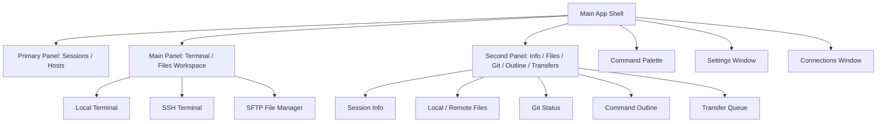

# Puck Terminal 文档：UI、主题与多语言

## 1. 设计原则

Puck Terminal 是工具型桌面应用，界面应优先服务高频操作：

- 信息密度适中，避免营销页式大面积装饰。
- 主要操作常驻，低频配置进入设置、菜单或命令面板。
- 终端区域最大化可用空间。
- 错误、断线、传输状态要清晰可见。
- 主题和字体设置不能影响终端可读性。
- 多窗口、快捷键和命令面板应指向同一套行为，不产生互相冲突的入口。

## 2. 信息架构



## 3. 主要界面

### 3.1 App Shell

当前应用主窗口包含：

- 左侧 Primary Panel。
- 中间 Main Panel。
- 右侧 Second Panel。
- 全局命令面板。
- 凭据提示 Dialog。
- Host Key Dialog。

当前行为：

- 可配置启动后是否打开本地终端。
- Primary / Second 面板可折叠，宽度写入 shell layout。
- 多标签支持关闭、切换、重命名和拖拽排序。
- 文件管理器和终端可以通过标签并存。
- 两窗格分屏支持上下左右方向。

### 3.2 Primary Panel：Sessions / Hosts

Sessions 页签：

- 展示本地终端、SSH 终端和文件会话。
- 支持按最近、名称升序、名称降序、自定义排序。
- 支持按工作目录自动分组和自定义分组。
- 支持拖拽排序、跨组移动、重命名会话、关闭会话。
- 支持新建本地终端、打开终端选择命令面板、快速连接。

Hosts 页签：

- 展示已保存远程 profile，不包含 local 和 ephemeral profile。
- 支持按协议自动分组、自定义分组、排序、拖拽、编辑、删除和连接。
- 选择主机会在 Main Panel 显示连接编辑表单。
- 可从右键菜单或工具栏创建分组、新建连接、快速连接。

已知限制：

- `hosts_layout` 前端持久化 key 尚未被 Rust 配置存储白名单接纳，主机分组布局暂不承诺跨重启可靠持久化。

### 3.3 Main Panel

Main Panel 根据当前主侧栏页签和 active session 切换内容：

- Sessions 页签下显示当前终端或文件管理器。
- Hosts 页签下显示远程连接管理主面板。
- 无会话时显示空态和新建终端入口。
- 顶部中间显示终端标题/路径栏，点击后打开标题菜单。

终端标题菜单支持：

- 自定义标签名称或前缀。
- 重置标题。
- 查看、复制、reveal 当前路径。
- 用外部应用打开路径。
- 会话通知与权限开关。
- 分屏。
- 搜索、全部标签搜索、跳转命令大纲、打开命令面板。

### 3.4 Second Panel

Second Panel 当前包含五个视图：

- Info：当前终端工作目录、复制路径、Finder reveal、进程摘要和占位端口信息。
- Files：本地终端显示本地目录；SSH 终端显示远程 SFTP 目录。
- Git：仅支持本地终端，显示当前工作目录 Git 分支、暂存、未暂存、未跟踪文件。
- Outline：当前终端输入命令列表，支持跳转到终端缓冲区行。
- Transfers：SFTP 上传下载队列。

Second Panel 可通过按钮、快捷键、命令面板切换或展开。

### 3.5 命令面板

命令面板是当前可用能力，不是预留入口。

当前支持的范围：

- `connect`：本地默认终端、检测到的 shell、已保存远程连接。
- `view`：主侧栏、次面板、详情视图、设置、搜索、命令大纲。
- `cwd`：当前目录 reveal、复制路径、打开应用子范围。
- `open`：用外部应用打开当前目录或文件所在目录。
- `action`：新建终端、选择终端、快速连接、新建连接。

限制：

- 外部应用打开目前由 Rust `open_path_in_app` 实现，仅支持 macOS。

### 3.6 文件管理器

独立文件管理器用于 SFTP profile。

界面元素：

- 路径面包屑。
- 文件列表。
- 隐藏文件切换。
- 上传按钮。
- 新建目录按钮。
- 刷新按钮。
- 删除、重命名、下载操作。

右侧 Files 面板是轻量文件浏览器：

- 本地终端下调用 `list_local_dir`。
- SSH 终端下通过 explorer SFTP session 调用 `list_remote_dir`。
- 用于快速浏览，不替代完整 SFTP 文件管理器的上传下载操作区。

### 3.7 设置页

Settings 独立窗口包含：

- General：语言、启动时打开本地终端、主/次面板默认可见性、重置设置。
- Appearance：应用配色主题、Light / Dark / System、终端字体、字号。
- Terminal：光标闪烁、选中即复制、scrollback、默认会话权限。
- Connections：known hosts 列表和删除。
- Keyboard：只读快捷键说明。
- About：版本与应用说明。

快捷键自定义尚未实现。

### 3.8 Connections 窗口

Connections 独立窗口用于集中管理远程连接：

- 新建、编辑、删除连接。
- 连接到已保存 profile。
- 通过 `connection:open-profile` 事件请求主窗口打开连接。
- 浏览器环境下降级使用 `BroadcastChannel`。

## 4. xterm.js 集成策略

每个终端标签包含一个独立 xterm.js 实例。

当前插件：

- `@xterm/addon-fit`：自适应容器尺寸。
- `@xterm/addon-search`：终端搜索。
- `@xterm/addon-web-links`：识别 URL。
- `@xterm/addon-clipboard`：剪贴板增强。

事件规则：

- `onData` 将用户输入转发到 Rust。
- 输入同时进入命令跟踪逻辑，用于命令大纲。
- `onResize` 将列数和行数转发到 Rust。
- 后端 `terminal:data` 事件写入对应 xterm 实例。
- 组件卸载时 dispose xterm 实例和插件，并从 registry 中注销。

## 5. 主题系统

### 5.1 应用 UI 主题

应用 UI 主题控制：

- 背景。
- 前景文字。
- 边框。
- 侧边栏。
- 弹窗。
- 按钮。
- 状态色。

支持：

- Light。
- Dark。
- System。
- 多套 color theme，例如 default、slate、zinc、stone、blue、green、rose、violet、nord、catppuccin。

### 5.2 终端外观

终端外观包含：

- 字体族。
- 字号。
- 光标闪烁。
- scrollback。
- 选中即复制。
- xterm 主题。

应用 UI 主题和终端外观可以独立配置。

## 6. 多语言

当前支持：

- `zh-CN`。
- `en-US`。

语言资源按模块组织：

```text
src/i18n/locales/
  zh-CN/
    common.json
    connections.json
    terminal.json
    files.json
    settings.json
    errors.json
    info.json
    command-palette.json
  en-US/
    common.json
    connections.json
    terminal.json
    files.json
    settings.json
    errors.json
    info.json
    command-palette.json
```

文案规则：

- 主要 UI 文案必须使用 i18n key。
- 错误信息由 Rust 返回结构化错误码，前端映射成本地化文案。
- 技术细节可以保留原始英文，但需要有本地化摘要。
- 日期、时间、文件大小按当前语言格式化。

## 7. 快捷键

当前已有固定快捷键，并在 Keyboard 设置区段以只读方式展示。

| 快捷键 | 功能 |
| --- | --- |
| Cmd/Ctrl + T | 新建本地终端，macOS 原生菜单支持 |
| Cmd/Ctrl + W | 关闭当前标签，macOS 原生菜单支持 |
| Cmd/Ctrl + Shift + P | 打开命令面板 |
| Cmd/Ctrl + , | 打开设置窗口 |
| Cmd/Ctrl + Shift + L | 切换主侧栏 |
| Cmd/Ctrl + Shift + R | 切换次面板 |
| Cmd/Ctrl + F | 搜索当前终端 |
| Cmd/Ctrl + Shift + F | 搜索全部终端 |
| Cmd/Ctrl + J | 跳转命令大纲 |
| Cmd/Ctrl + D | 向右分屏 |
| Alt + Cmd/Ctrl + D | 向左分屏 |
| Shift + Cmd/Ctrl + D | 向下分屏 |
| Alt + Shift + Cmd/Ctrl + D | 向上分屏 |

后续若支持快捷键自定义，需要特别处理终端输入区域和全局快捷键的作用域冲突。

## 8. 可访问性

基础要求：

- 图标按钮必须有 tooltip 或 aria-label。
- Dialog 和辅助窗口必须有标题。
- 键盘可以访问主要操作。
- 主题色对比度必须保证终端可读。
- 状态变化不能只依赖颜色，也需要文字或图标提示。
- 快捷键触发的行为应能通过菜单或命令面板找到等价入口。

## 9. UI 检查清单

后续调整样式时，至少检查：

- Light / Dark / System 三种应用主题。
- 多套 color theme 下主侧栏、主面板、次面板的层级。
- 中文和英文文本长度，尤其是按钮、Dialog、Popover、辅助窗口和侧栏。
- 800x600 左右的小窗口布局。
- 连接失败、host key 未信任、传输失败、空目录、无连接、无 Git 仓库等状态。
- 终端标签切换、分屏和面板折叠后的 xterm resize。
- Settings / Connections 辅助窗口与主窗口之间的同步。
