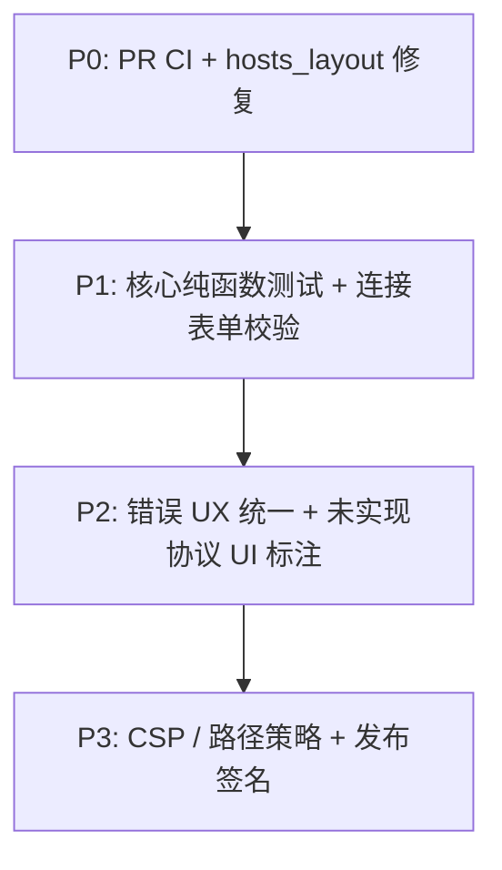

# Puck 代码审查：问题与改进建议

> 文档版本：1.0  
> 基准版本：`0.1.0-alpha.1`  
> 审查范围：全仓库（前端 `src/`、后端 `src-tauri/`、CI、文档）  
> 关联文档：[路线图、风险与验收](05-roadmap-risks-and-acceptance.md)、[架构与技术栈](02-architecture-and-stack.md)

本文档基于当前代码实现，汇总项目的主要不足、已知缺陷与改进建议，供后续迭代排期参考。

---

## 1. 总体评价

Puck 是一个架构清晰、文档诚实的 alpha 桌面应用（Tauri v2 + React + Rust，约 23k LOC）。前后端职责划分合理，安全边界（钥匙串、host key 校验）有认真设计。

| 维度 | 评价 | 说明 |
| --- | --- | --- |
| 架构设计 | 强 | FE/BE 分层清晰，IPC 封装、Zustand 持久化适配器设计合理 |
| 代码质量 | 良好 | TypeScript `strict`、Rust 结构化错误、模块边界清楚 |
| 文档 | 强于同类 alpha | `docs/` 与 README 对未实现功能有明确说明 |
| 测试与 CI | 明显短板 | 零自动化测试，仅 tag 触发的 release 流水线 |
| 产品完整度 | alpha 合理 | 核心 SSH/SFTP/终端可用，若干协议仍为占位 |

**结论：** 当前最大短板不是架构，而是缺少自动化测试与 PR 级 CI；其次是已知的 `hosts_layout` 持久化 bug，以及若干协议占位带来的用户体验落差。

---

## 2. 最关键：缺少质量保障体系

### 2.1 现状

- README 明确说明：当前仓库没有配置独立的单元测试或端到端测试脚本，验收以构建检查和手动验证为主。
- `package.json` 仅有 `dev`、`build`、`preview`、`tauri`，无 `test`、`lint`、`typecheck` 脚本。
- 应用代码中无 `*.test.ts`、`*.spec.ts` 或 Rust `#[cfg(test)]` 模块。
- CI 仅有 `.github/workflows/release.yml`（tag 触发发布），**无 PR / push 构建验证**。

### 2.2 风险

| 风险点 | 说明 |
| --- | --- |
| 配置迁移回归 | `config.rs` 的旧版 JSON → TOML 迁移逻辑一旦改错，可能静默损坏用户 `config.toml` |
| 安全逻辑无保护 | `known_hosts` 信任策略、`host_key_unknown` 流程无自动化回归 |
| 纯函数易退化 | `puck-error.ts` 解析、hosts/sidebar 分组逻辑等无测试覆盖 |
| 合并无门禁 | PR 合入前不跑 `build` / `cargo check`，编译错误可能直接进入主分支 |

### 2.3 建议

**P0 — 立即：**

1. 新增 PR CI workflow：`npm run build` + `cd src-tauri && cargo check`
2. 增加 `npm run typecheck`（`tsc --noEmit`）

**P1 — 短期：**

1. **Vitest**：`puck-error.ts`、hosts/sidebar 分组纯函数、连接表单校验逻辑
2. **Rust `#[cfg(test)]`**：`config` 迁移、`known_hosts` 信任逻辑、`workspace` 路径解析
3. CI 增加 `clippy -D warnings`、ESLint（引入后）

**P2 — 中期：**

- Tauri IPC 契约的集成测试或 smoke test
- Dependabot / Renovate 依赖安全更新

---

## 3. 已知 Bug：`hosts_layout` 持久化不一致

### 3.1 问题描述

前端在 `src/lib/puck-config-storage.ts` 中定义了 `hosts_layout` 持久化 key，但 Rust 配置存储白名单（`src-tauri/src/config.rs`）未包含该区段。

**前端 key 定义：**

```typescript
// src/lib/puck-config-storage.ts
export const PUCK_CONFIG_KEYS = {
  // ...
  hostsLayout: "hosts_layout",
  // ...
};
```

**Rust 白名单（缺少 `hosts_layout`）：**

```rust
// src-tauri/src/config.rs
const UI_SECTIONS: [&str; 5] = [
    SECTION_APP_SETTINGS,
    SECTION_CONNECTIONS,
    SECTION_SIDEBAR_LAYOUT,
    SECTION_SESSION_PRIVILEGES,
    SECTION_SHELL_LAYOUT,
];
```

### 3.2 影响

- 主机分组 UI 在运行时可正常工作
- **应用重启后主机分组布局丢失**
- 文档已在多处标注此限制，但用户仍可能误以为已持久化

### 3.3 修复建议

1. 在 `config.rs` 增加 `SECTION_HOSTS_LAYOUT` 常量
2. 将 `hosts_layout` 加入 `UI_SECTIONS` 与 `PuckConfigFile` 结构体
3. 补充迁移与读写测试
4. 更新 README 与路线图中的「已知限制」条目

**优先级：P0**（改动面小、用户可感知、文档已多次提及）

---

## 4. 功能占位与用户体验落差

以下能力在连接模型、类型或 UI 层已存在，但后端未完整实现。README 与 `05-roadmap-risks-and-acceptance.md` 已有记录，此处汇总便于排期。

| 能力 | 当前状态 | 用户风险 |
| --- | --- | --- |
| FTP / FTPS | 连接模型 + UI 预留，无 Rust 后端 | 用户可能误以为协议已可用 |
| SSH Agent | 认证类型已定义，未实现 | 选项无效或行为不符预期 |
| ProxyJump | 类型/UI 预留 | 同上 |
| 端口转发 | 未实现 | — |
| 传输取消 / 暂停 / 恢复 | SFTP 队列支持进度与重试，不支持取消 | 大文件传输体验不完整 |
| `open_path_in_app` | 仅 macOS 实现 | Windows/Linux 返回不支持错误 |
| 快捷键自定义 | 固定实现 + 只读设置说明 | 高级用户期望无法满足 |
| 目录同步、远程文件预览/编辑 | 未实现 | — |

### 建议

1. **P0**：连接表单对 FTP/FTPS 等未实现协议做禁用或明确「尚未支持」标注
2. **P1**：传输取消；`open_path_in_app` 跨平台实现或按平台隐藏
3. **P2**：SSH Agent、ProxyJump、FTP 后端等按路线图推进

---

## 5. 安全与边界控制

### 5.1 已做好的部分

- 密码、私钥口令存入系统钥匙串（`keyring`），不写入 `config.toml`
- SSH 未知 host key 需用户确认，trusted keys 单独存于 `known_hosts.json`
- Tauri capabilities 按窗口（`main`、`settings`、`connections`、`editor-*`）限定权限
- 编辑器读取本地文件有 2MB 上限（`workspace.rs`）

### 5.2 待加强项

| 问题 | 严重程度 | 说明 |
| --- | --- | --- |
| CSP 未配置 | 中 | `tauri.conf.json` 中 `"csp": null`，生产环境建议收紧 |
| 本地路径无沙箱 | 中 | `workspace.rs` 的读写 IPC 可访问用户可读的任意路径；面向更广泛分发时可考虑可选「工作区根目录」限制 |
| 连接表单校验不足 | 低–中 | 无 Zod/valibot 等校验层，空 host/username 可能被保存 |
| 发布签名未启用 | 低（分发） | release workflow 中签名相关配置被注释 |
| IPC 传递密码 | 低 | 连接时密码经 invoke 传入 Rust，Tauri 桌面应用常见，建议在安全文档中说明 |
| Cargo 元数据不完整 | 低 | `authors = ["you"]` 等待完善 |

### 建议

1. 为生产构建配置合适的 CSP
2. 连接保存/连接前校验必填字段（host、username、远程协议端口等）
3. 公开发布前启用代码签名与 updater 签名
4. 可选：为 `read_local_file` / `write_local_file` 增加工作区根路径策略

---

## 6. 错误处理不一致

### 6.1 已有基础设施

- **Rust**：`PuckError` 枚举 + `puck_err()`，错误码含 `auth_failed`、`network_error`、`host_key_unknown` 等
- **前端**：`src/lib/puck-error.ts` 提供 `parsePuckError()`、`isHostKeyError()`
- **i18n**：`src/i18n/locales/*/errors.json`（覆盖偏薄，约 6 个错误码）

### 6.2 不一致表现

| 场景 | 当前行为 |
| --- | --- |
| 部分 `invoke` 失败 | 静默 `.catch(() => setShells([]))` 等 |
| 辅助窗口打开失败 | 往往仅 `console.error` |
| 连接保存 / 凭据持久化失败 | 有时无 toast 或 i18n 提示 |
| host key / SFTP / Git | 部分流程已正确使用 `parsePuckError` |

### 建议

对用户主动触发的 IPC 操作统一流程：

```
invoke 失败 → parsePuckError → i18n 映射 → toast 展示
```

扩展 `errors.json` 错误码覆盖，避免裸 `String` 或 `console.error` 作为最终用户反馈。

---

## 7. 工程化与开发体验

| 缺失项 | 影响 |
| --- | --- |
| ESLint / Prettier | 风格与潜在问题无自动检查 |
| 独立 `typecheck` 脚本 | 虽 `build` 会跑 `tsc`，但不便于 CI 与本地快速检查 |
| Clippy / rustfmt 配置 | Rust 代码风格与 lint 未标准化 |
| Dependabot / Renovate | 依赖安全更新无自动化 |
| CONTRIBUTING.md | 协作规范缺失 |
| CHANGELOG.md | 版本变更追溯成本高 |

### 依赖与构建

- 前端：React 19、Vite 7、Tailwind 4，栈较新
- 较重依赖：`monaco-editor`、`@xterm/xterm`、`motion`
- Monaco 已在编辑器窗口使用动态 `import()`，方向正确；建议审计主 bundle 确保 worker 不进入主包
- Rust：`edition = "2024"`，需确认团队工具链兼容性
- `shadcn` 作为 npm 依赖（v4）较非常规，通常仅为 CLI 工具

---

## 8. 架构层面的小不一致

### 8.1 持久化模式不统一

- 多数 store 通过 Zustand `persist()` + `puckConfigStorage` 适配器
- `shell_layout` 部分逻辑在 `app-shell.tsx` 中手动读写
- 长期维护成本上升，建议逐步统一到同一持久化路径

### 8.2 未知配置区段静默丢弃

`config.rs` 的 `set_section_value` 对不在白名单的 key 直接 no-op，不报错、不日志。调试时容易误以为数据已落盘（`hosts_layout` 即为此类问题的实例）。

**建议：** 对未知 section 返回明确错误或至少记录 warn 日志。

### 8.3 全局单例与可测试性

- `SessionManager::global()`、`runtime()` 等全局单例适合桌面应用运行时
- 代价是单元测试与 mock 成本较高；引入测试时需考虑依赖注入或测试专用入口

### 8.4 Mutex `unwrap()` 模式

`config.rs`、`known_hosts.rs` 等处使用 `Mutex::lock().unwrap()`，在 mutex 被 poison 时会 panic。可考虑 `parking_lot::Mutex` 或显式 poison 处理。

---

## 9. 改进优先级总览



| 优先级 | 事项 | 预期收益 |
| --- | --- | --- |
| **P0** | 新增 PR CI（build + cargo check） | 防止编译回归进入主分支 |
| **P0** | 修复 `hosts_layout` 持久化 | 修复用户可感知的数据丢失 |
| **P1** | config 迁移、error 解析、表单校验测试 | 核心逻辑回归保护 |
| **P1** | 连接表单必填校验 | 减少无效配置与连接失败 |
| **P2** | 统一错误展示（toast + i18n） | 提升故障可诊断性 |
| **P2** | FTP/FTPS 等协议 UI 明确标注 | 降低用户误解 |
| **P3** | CSP、可选工作区路径限制 | 安全加固 |
| **P3** | 代码签名、CHANGELOG、CONTRIBUTING | 发布与协作规范化 |

---

## 10. 与现有文档的对应关系

| 本文档章节 | 可对照文档 |
| --- | --- |
| `hosts_layout` | `01-overview-and-mvp.md`、`02-architecture-and-stack.md`、`05-roadmap-risks-and-acceptance.md` |
| 功能占位 | `03-connection-model-and-protocols.md`、`05-roadmap-risks-and-acceptance.md` |
| 安全边界 | `02-architecture-and-stack.md` |
| 测试策略 | `05-roadmap-risks-and-acceptance.md` § 测试与验收 |
| 已知限制列表 | 根目录 `README.md` § 已知限制 |

---

## 11. 修订记录

| 版本 | 日期 | 说明 |
| --- | --- | --- |
| 1.0 | 2026-07-01 | 初版：基于全仓库代码审查输出 |
